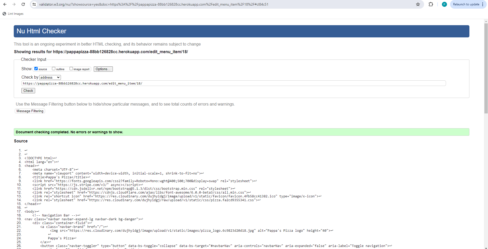
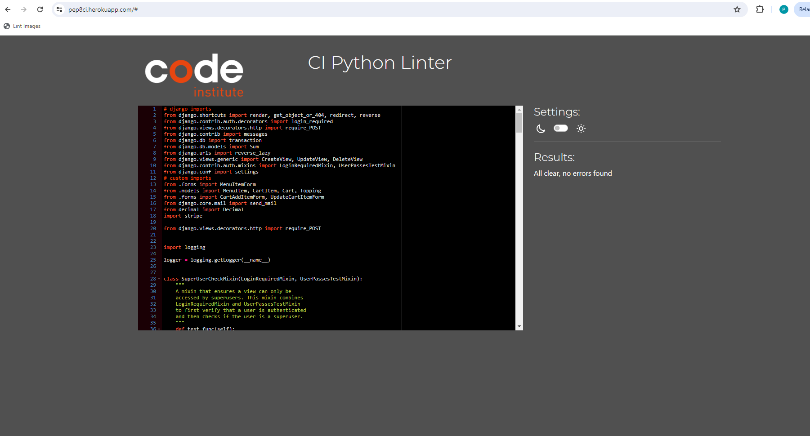
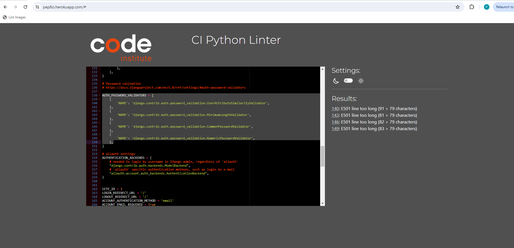
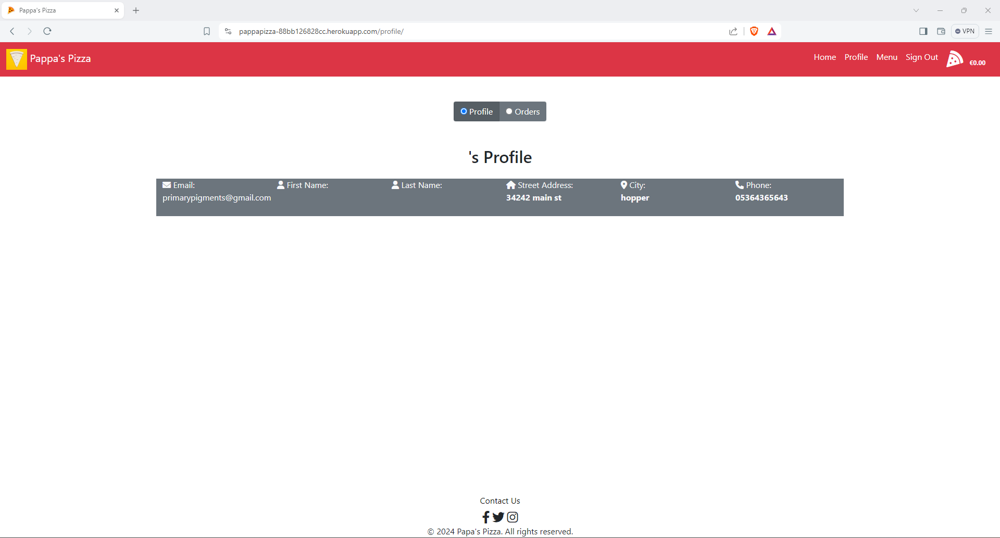
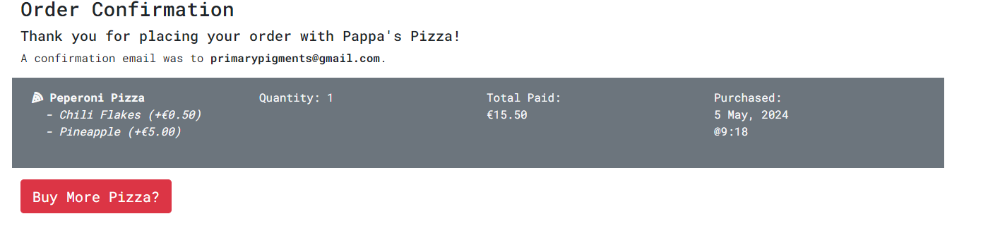

TESTING.md 
# Testing

> [!NOTE]  
> Return back to the [README.md](README.md) file.

## Code Validation

### HTML

I have used the recommended [HTML W3C Validator](https://validator.w3.org) to validate all of my HTML files.

| Directory | File | Screenshot | Notes |
| --- | --- | --- | --- |
| Index | index.html |  | |
| Cart | cart.html |  | |
| Checkout | error.html |  | |
| Checkout | success.html |  | |
| Checkout | success_profile.html |  | |
| Contact | contact.html |  | |
| Menu | menu.html |  | |
| Menu | edit_menu.html |  | |
| Profile | profile.html |  | |
| Templates | 404.html |  | |
| Templates | 500.html |  | |
| Accounts | login.html |  | |
| Accounts | password_reset.html |  | |
| Accounts | singup.html |  | |

### CSS

I have used the recommended [CSS Jigsaw Validator](https://jigsaw.w3.org/css-validator) to validate all of my CSS files.

| Directory | File | Screenshot | Notes |
| --- | --- | --- | --- |
| static | pizza.css |  | |
| static | index.css |  | |

### Python

I have used the recommended [PEP8 CI Python Linter](https://pep8ci.herokuapp.com) to validate all of my Python files.

| Directory | File | CI URL | Screenshot | Notes |
| --- | --- | --- | --- | --- |
| index | admin.py | [PEP8 CI](https://pep8ci.herokuapp.com/https://raw.githubusercontent.com/primarypigments/papas_pizza/main/index/admin.py) |  | |
| index | forms.py | [PEP8 CI](https://pep8ci.herokuapp.com/https://raw.githubusercontent.com/primarypigments/papas_pizza/main/index/forms.py) |  | |
| index | models.py | [PEP8 CI](https://pep8ci.herokuapp.com/https://raw.githubusercontent.com/primarypigments/papas_pizza/main/index/models.py) |  | |
| index | urls.py | [PEP8 CI](https://pep8ci.herokuapp.com/https://raw.githubusercontent.com/primarypigments/papas_pizza/main/index/urls.py) |  | |
| index | validators.py | [PEP8 CI](https://pep8ci.herokuapp.com/https://raw.githubusercontent.com/primarypigments/papas_pizza/main/index/validators.py) |  | |
| index | views.py | [PEP8 CI](https://pep8ci.herokuapp.com/https://raw.githubusercontent.com/primarypigments/papas_pizza/main/index/views.py) |  | |
|  | manage.py | [PEP8 CI](https://pep8ci.herokuapp.com/https://raw.githubusercontent.com/primarypigments/papas_pizza/main/manage.py) |  | |
| menu_cart | admin.py | [PEP8 CI](https://pep8ci.herokuapp.com/https://raw.githubusercontent.com/primarypigments/papas_pizza/main/menu_cart/admin.py) |  | |
| menu_cart | cart_context_processor.py | [PEP8 CI](https://pep8ci.herokuapp.com/https://raw.githubusercontent.com/primarypigments/papas_pizza/main/menu_cart/cart_context_processor.py) |  | |
| menu_cart | forms.py | [PEP8 CI](https://pep8ci.herokuapp.com/https://raw.githubusercontent.com/primarypigments/papas_pizza/main/menu_cart/forms.py) |  | |
| menu_cart | models.py | [PEP8 CI](https://pep8ci.herokuapp.com/https://raw.githubusercontent.com/primarypigments/papas_pizza/main/menu_cart/models.py) |  | |
| menu_cart | shell.py | [PEP8 CI](https://pep8ci.herokuapp.com/https://raw.githubusercontent.com/primarypigments/papas_pizza/main/menu_cart/shell.py) |  | |
| menu_cart | urls.py | [PEP8 CI](https://pep8ci.herokuapp.com/https://raw.githubusercontent.com/primarypigments/papas_pizza/main/menu_cart/urls.py) |  | |
| menu_cart | validators.py | [PEP8 CI](https://pep8ci.herokuapp.com/https://raw.githubusercontent.com/primarypigments/papas_pizza/main/menu_cart/validators.py) |  | |
| menu_cart | views.py | [PEP8 CI](https://pep8ci.herokuapp.com/https://raw.githubusercontent.com/primarypigments/papas_pizza/main/menu_cart/views.py) |  | |
| pizza_time | settings.py | [PEP8 CI](https://pep8ci.herokuapp.com/https://raw.githubusercontent.com/primarypigments/papas_pizza/main/pizza_time/settings.py) |  | |
| pizza_time | urls.py | [PEP8 CI](https://pep8ci.herokuapp.com/https://raw.githubusercontent.com/primarypigments/papas_pizza/main/pizza_time/urls.py) |  | |

## Browser Compatibility

I've tested my deployed project on multiple browsers to check for compatibility issues.

| Browser | Home | Contact | Register | Sign In | Menu | Profile | Edit Menu | Cart | Success | Success Profile | 404 | Checkout | Error | Password Reset | 500 |Result |
| --- | --- | --- | --- | --- | --- | --- | --- | --- | --- | --- | --- | --- | --- | --- | --- | --- | 
| Opera |  |  |  |  |  |  |  |  |  |  |  |  |  |  |  | Works as expected |
| Chrome |  |  |  |  |  |  |  |  |  |  |  |  |  |  |  | Works as expected |
| Brave |  |  |  |  |  |  |  |  |  |  |  |  |  |  |  | Works as expected |

## Responsiveness

I've tested my deployed project on multiple devices to check for responsiveness issues.

| Browser | Home | Contact | Register | Sign In | Menu | Profile | Edit Menu | Cart | Success | Success Profile | Error | 404 | Password Reset | 500 | Result |
| --- | --- | --- | --- | --- | --- | --- | --- | --- | --- | --- | --- | --- | --- | --- | --- |  
| Mobile (DevTools) |  |  |  |  |  |  |  |  |  |   |  |  |  |  | Works as expected |
| Tablet (DevTools) |  |  |  |  |  |  |  |  |   |  |  |  |  | Works as expected |
| Desktop |  |  |  |  |  |  |  |  |  |   |  |  |  |  | Works as expected |

## Lighthouse Audit

I've tested my deployed project using the Lighthouse Audit tool to check for any major issues.

| Page | Mobile | Desktop | Notes |
| --- | --- | --- | --- |
| Home |  |  | Some minor warnings |
| Contact |  |  | Some minor warnings |
| Register |  |  | Some minor warnings |
| Sign In |  |  | Some minor warnings |
| Menu |  |  | Some minor warnings |
| Profile |  |  | Slow response time due to large images |
| Edit |  |  | Some minor warnings |
| Success |  |  | Some minor warnings |
| Success Profile |  |  | Some minor warnings |
| Forgot Password |  |  | Some minor warnings |
| Cart |  |  | Some minor warnings |
| Checkout |  |  | Some minor warnings |
| Error |  |  | Some minor warnings |
| 404 |  |  | Some minor warnings |
| 500 |  |  | Some minor warnings |

## Defensive Programming

Defensive programming was manually tested with the below user acceptance testing:

| Page | Expectation | Test | Result | Fix | Screenshot |
| --- | --- | --- | --- | --- | --- |
| Home | | | | | |
| | Contact is expected to go to contact page when the user clicks on link | Tested the feature by doing clicking on link | The feature behaved as expected, and it did go to contact page | Test concluded and passed |  |
| | Navbar is expected to go to respective pages when the user clicks on links | Tested the feature by doing clicking on links | The feature behaved as expected, and it did go to respectivepages pages | Test concluded and passed |  |
| | Pizza modal link is expected to open the menu page authenticated or register unauthenticated when the user clicks on it. | Tested the feature by clicking on the link. | The feature behaved as expected and opened when clicked. | Test concluded and passed. |  |
| | Social Media links are expected to open their pages when the user clicks on them | Tested the feature by doing clicking on the link | The feature behaved as expected, and opened when clicked | Test concluded and passed |  |
| | Cart Total is expected to  total users cart total when items are added to cart | Tested the feature by doing items are added to cart | The feature behaved as expected, and it did display cart total | Test concluded and passed |  |
| Register | | | | | |
| | Number is expected to be required when the user does not not fill it out | Tested the feature by leaving it blank | The feature behaved as expected, and it give the user a message a the input is required | Test concluded and passed |  |
| | Address is expected to be required when the user does not not fill it out | Tested the feature by leaving it blank | The feature behaved as expected, and it give the user a message a the input is required | Test concluded and passed |  |
| | City is expected to be required when the user does not not fill it out | Tested the feature by leaving it blank | The feature behaved as expected, and it give the user a message a the input is required | Test concluded and passed |  |
| | Zip Code is expected to be required when the user does not not fill it out | Tested the feature by leaving it blank | The feature behaved as expected, and it give the user a message a the input is required | Test concluded and passed |  |
| | News Letter is expected to be checked if the user clicks the box | Tested the feature by clicking on the box| The feature behaved as expected, box is checked | Test concluded and passed |  |
| | Email is expected to be required when the user does not not fill it out | Tested the feature by leaving it blank | The feature behaved as expected, and it give the user a message a the input is required | Test concluded and passed |  |
| | First Name is expected to be required when the user does not not fill it out | Tested the feature by leaving it blank | The feature behaved as expected, and it give the user a message a the input is required | Test concluded and passed |  |
| | Last Name is expected to be required when the user does not not fill it out | Tested the feature by leaving it blank | The feature behaved as expected, and it give the user a message a the input is required | Test concluded and passed |  |
| | Password1 Passowrd2 is expected to be required when the user does not not fill it out and will only accept password format | Tested the feature by leaving it blank and inouting a invalid passowrd format | The feature behaved as expected, and it give the user a message a the input is required or in enter valid format | Test concluded and passed |  |
| | Register Button is expected to post registration of user when user clicks on the button | Tested the feature by doing clicking on button | The feature behaved as expected, and it gave success message | Test concluded and passed |  |
| Profile | | | | | |
| | Past Orders list is expected to display users Past Orders when a user clicks on the radio button | Tested the feature by clicking the on the radio button | The feature behaved as expected, and it displays Past Orders | Test concluded and passed |  |
| | View Order Button expected to redirect to selected past order. | Tested the feature by clicking the button | The feature behaved as expected, and it redirected the user to the selected past order. | Test concluded and passed |  |
| Sign In | | | | | |
| | Email is expected to be required when the user does not not fill it out | Tested the feature by leaving it blank | The feature behaved as expected, and it give the user a message a the input is required | Test concluded and passed |  |
| | Sign In Button is expected when successfull redirect to index page with a success message  | Tested the feature by filling out a valid email and password and clicking the sign in button | The feature behaved as expected, and it redirected to index page with success message. | Test concluded and passed |  |
| | Forgot Passowrd link expected to redirect to a forgot password page. | Tested the feature by clicking the button | The feature behaved as expected, and it redirected the user to the forgot passowrd page. | Test concluded and passed |  |
| 404 | | | | | |
| | 404 is expected to direct user to 404 page when an invalid page is entered. | Tested the feature by doing filling out  entering an invalid page. | The feature behaved as expected, and it directed to 404 page. | Test concluded and passed |  | |
| Menu | | | | | |
| | Pizza Order Modal is expected to display Pizza order options when a user clicks on the view details button | Tested the feature by clicking the on the view details button | The feature behaved as expected, and it displays pizza order options | Test concluded and passed |  |
| | Pizza Order Modal Form is expected to display Pizza toppings options, quanity and a add to cart button and add items to cart. | Tested the feature by clicking the on toppings adding more or less pizza quanity and clicking add to cart button | The feature behaved as expected, and it succfully added pizza with toppings to cart| Test concluded and passed |  |
| | Add Pizza Modal is expected to display Pizza a form to add a new pizza when a user clicks on the Add New Item button | Tested the feature by clicking the on the Add new Item button | The feature behaved as expected, and it displays Add new item form | Test concluded and passed |  |
| | Edit Pizza Button expected to redirect to a Edit pizza page. | Tested the feature by clicking the button | The feature behaved as expected, and it redirected the user to the Edit pizza page. | Test concluded and passed |  |
| | Delete item Button expected to display delete item modal. | Tested the feature by clicking the button | The feature behaved as expected, and it displayed the user the Delete item modal. | Test concluded and passed |  |
| Edit Menu | | | | | |
| | Edit Menu Form is expected to display Pizza Item options to edit (name, price, description, picture) | Tested the feature by editing a pizza item | The feature behaved as expected, and changes were saved | Test concluded and passed |  |
| Cart | | | | | |
| | Shopping cart is expected to display Pizza Item with toppings, have the ablity to change the quanity or delete items, at bottom of cart there is a link to the menu. | Tested the feature by changeing quanity, deleting, and clicking the back to menu link | The feature behaved as expected, and quanities changed, item deleted, link direceted to menu. | Test concluded and passed |  |
| | Summary expected to display the total cost, the option to choose delivery or pick up, and a checkout button. | Tested the feature by choosing pick up or delivery or pick up and clicking the checkout button | The feature behaved as expected, and it displayed delivery or pick up, and the checkout button redirected to stripe checkout session. | Test concluded and passed |  |
| Checkout Success  | | | | | |
| |  Checkout Success is expected to display a successful order with details | Tested the feature by creating a successful order | The feature behaved as expected, and was redirected to successful checkout page | Test concluded and passed |  |
| Checkout Success Profile | | | | | |
| |  Checkout Success is expected to display a successful order with details | Tested the feature by creating a successful order | The feature behaved as expected, and was redirected to successful checkout page | Test concluded and passed |  |
| Contact  | | | | | |
| |  Contact form is expected to be required when the user does not not fill it out | Tested the feature by leaving it blank | The feature behaved as expected, and it give the user a message a the input is required | Test concluded and passed |  |

## Bugs

### GitHub **Issues**

**Fixed Bugs**

All previously closed/fixed bugs can be tracked [here](https://github.com/primarypigments/papas_pizza/issues?q=is%3Aissue+is%3Aclosed).

| Bug | Status |
| --- | --- |
| [Python `Stripe Checkout Miscalculation` ](https://github.com/primarypigments/papas_pizza/issues/17) | Closed |
| [Python `TypeError` unsupported operand type(s) for +: 'float' and 'decimal.Decimal'](https://github.com/primarypigments/papas_pizza/issues/2) | Closed |
| [Django `TemplateDoesNotExis` at index/index.html ](https://github.com/primarypigments/papas_pizza/issues/10) | Closed |
| [Django `TemplateSyntaxError` at /accounts/signup/ ](https://github.com/primarypigments/papas_pizza/issues/12) | Closed |
| [Python `Miscalculation of toppings` at index/index.html ](https://github.com/primarypigments/papas_pizza/issues/14) | Closed |
| [Python `TemplateDoesNotExis` at index/index.html ](https://github.com/primarypigments/papas_pizza/issues/10) | Closed |
| [Python `AttributeError` object has no attribute 'try_save' ](https://github.com/primarypigments/papas_pizza/issues/13) | Closed |
| [Python `DisallowedHost` Invalid HTTP_HOST header: '8000-primarypigme-papaspizza-qedyxbyhnxl.ws-eu110.gitpod.io' ](https://github.com/primarypigments/papas_pizza/issues/11) | Closed |
| [Python `AttributeError` object has no attribute 'try_save' ](https://github.com/primarypigments/papas_pizza/issues/13) | Closed |

**Open Issues**

Any remaining open issues can be tracked [here](https://github.com/primarypigments/papas_pizza/issues).

## Unfixed Bugs
 
> There are no remaining bugs that I am aware of.